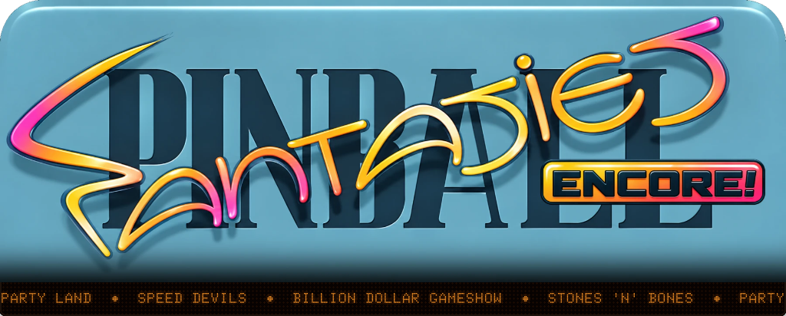
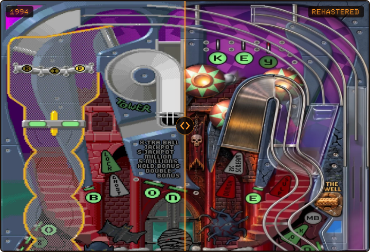

<p align="center"></p>

# Pinball Fantasies: Encore!

[](https://github.com/pedrocatalao/pinball-fantasies-encore/actions/workflows/macos.yml)
[](https://github.com/pedrocatalao/pinball-fantasies-encore/actions/workflows/linux.yml)
[](https://github.com/pedrocatalao/pinball-fantasies-encore/actions/workflows/windows.yml)

A native version of *Pinball Fantasies* (Digital Illusions / 21st Century Entertainment, 1994
PC release) for macOS, Linux and Windows, in C++20 on SDL3 and OpenGL, with remastered artwork
alongside the original look.

**An engine of its own.** Since 1.1.0 the game runs on an engine written from scratch from the
DOS game's own code: the physics, the rules of all four tables, the dot matrix, the music, the
slides and the menu. With its few deliberate adjustments set aside, it plays every table frame
for frame as the 1994 game does, which is how it was checked; the adjustments, and why they
were made, are in [differences from the original](docs/differences-from-the-original.md), and
how the engine was built in [the own engine](docs/own-engine.md). It reads the original DOS
files: nothing of the original is emulated, and nothing of it is included here.

## Download

Unpack and run, no installation. The newest version, whichever it is:

<p align="center">
<a href="https://github.com/pedrocatalao/pinball-fantasies-encore/releases/latest/download/pinball-fantasies-encore-macos-universal.zip"></a>
<a href="https://github.com/pedrocatalao/pinball-fantasies-encore/releases/latest/download/pinball-fantasies-encore-windows-x64.zip"></a>
<a href="https://github.com/pedrocatalao/pinball-fantasies-encore/releases/latest/download/pinball-fantasies-encore-linux-x86_64.tar.gz"></a>
<a href="https://github.com/pedrocatalao/pinball-fantasies-encore/releases/latest/download/pinball-fantasies-encore-linux-arm64.tar.gz"></a>
</p>

Played on macOS, Windows and Linux. If something is wrong on yours, an
[issue](https://github.com/pedrocatalao/pinball-fantasies-encore/issues) is the news I am after.

On macOS the application is not signed, so the system refuses it the first time — see
[a downloaded build on macOS](#a-downloaded-build-on-macos) below. On Linux, `./install.sh`
from the unpacked folder puts the game in your menu with its icon, all under `~/.local`;
it's optional, and the game runs from the folder just the same. Every release is also on
the [releases page](https://github.com/pedrocatalao/pinball-fantasies-encore/releases).

## The remaster

All four tables play exactly as the original does, and the picture on top of it can be either
the 1994 one or a remastered one (F10 switches, at any time).

**None of it is an upscale.** No filter was run over the original pictures, nothing was
enlarged and smoothed, and no machine guessed at the missing detail. Every playfield, slide,
banner, flipper and ball was made again at high resolution, drawn to the original's own
shapes, colours, lamps and lettering, so that what is on screen keeps the feel of the table
as it was rather than becoming a blurred blow-up of it. That is also why the two pictures sit
on each other exactly, pixel area for pixel area, and why F10 can swap them mid-ball:

- **Redrawn playfields** at high resolution for every table, with the lamps still working: the
  game records, per screen pixel, which original pixel it drew and how lit that spot is, and
  the renderer blends between a lit and an unlit copy of the picture there. Lamps keep their
  own shapes, labels and all.
- **Flippers drawn once and turned in code** instead of the original's frames, each about the
  axis its own artwork hinges on, so they follow the table's own angles exactly.
- **A high-resolution ball** that goes behind ramps and rails as smoothly as the artwork covers
  it, with a subtle trail that follows the physics steps rather than the frames (F8 while
  paused turns the trail off).
- **A CRT look** (scanlines, shadow mask, glow) on F9, and the original crisp pixels without it.

The redrawn pictures live in `assets/hd`, but they are not in the downloads: the first time it
starts, the game offers to fetch them (about 31 MB), and later offers each new version of
them. Until then, or if you say no, it shows the original pictures. `--hd-dir` points it at a
folder of pictures instead, such as `assets/hd` while drawing them.

### The same screens, either way

The same moment on Stones 'n' Bones, drawn twice, with the line sweeping across it: the 1994
artwork on the left of the line, the remastered one on the right. Everything else -- the
geometry, the lamps, the scrolling, the physics -- is the same on both sides. The right-hand
side is not the left one enlarged: it is its own picture, drawn to sit over the original's
shapes.

<p align="center"></p>

## Game files

Nothing from the original is included here, apart from the redrawn pictures in `assets/hd`.
The game reads the pictures, collision maps, scripts, music and effects from a copy of the
DOS files, and it needs **exactly** the 1994 disk release, because it takes the data from
fixed addresses. Every file is checked at start-up, and a folder holding any other release
is refused; [docs/game-files.md](docs/game-files.md) lists the files and their checksums.

> As long as you confirm you legally own a copy of the game, the correct files will be downloaded and unpacked automatically the first time you run it. 

The files are then read from one place and one only: a `FANTASY` folder inside the folder this
version keeps its own things in, which is the folder SDL gives it for the platform —
`~/Library/Application Support/Encore/Pinball Fantasies/FANTASY` on macOS,
`~/.local/share/Encore/Pinball Fantasies/FANTASY` on Linux,
`%APPDATA%\Encore\Pinball Fantasies\FANTASY` on Windows.

You can also put the files there yourself, or start the game with `--data <dir>` to read
another folder for that run.

Options and high scores are kept beside it, in the DOS formats
(`PINBALL.CFG`, `TABLEn.HI`), and every game played is kept as a recording in `replays/`.

## Screen sizes and recordings

The resolution option has the original's two sizes, which follow the ball up and down the
table, and two that show the whole table at once:

- **Normal** and **High**: 240 and 350 rows, as in 1994.
- **Full**: the whole table and the dot matrix, with High's pixels, for an ordinary screen.
- **Tall**: the whole table with square pixels, for a wide screen turned on its side, where it
  nearly fills the height.

A recording (`.RPL`) dropped on the game's window plays the game again, in your own screen
size, whatever its player used; Escape stops it. The online scores' recordings can be
downloaded from the website and watched the same way.

## A downloaded build on macOS

The application is signed without a certificate, so macOS quarantines it like anything else
from the internet and refuses to open it — from the Finder it does nothing at all, while the
binary inside still runs from a terminal. Either right-click it and choose Open, and then Open
again, or clear the flag:

```bash
xattr -dr com.apple.quarantine "Pinball Fantasies.app"
```

Signing it properly, so that nobody has to do this, needs an Apple Developer certificate and
notarisation.

## Controls

The original layout.

| Key | Action |
| --- | --- |
| F1 to F4 | choose a table in the menu |
| F5 | options (in the menu) |
| Enter | start a game; again, before plunging, to add a player (or F1 to F8 for 1 to 8 players) |
| Left and right Shift, Ctrl or Alt | flippers |
| Down arrow | pull the plunger, release to shoot |
| Space | nudge the table (too often tilts it) |
| P | pause (see below) |
| M | music on or off, kept as the music option for the next game too |
| Escape | with the ball at the plunger, abandon the game; in attract mode, leave the table (Y to confirm); in the menu, quit |
| F11 | fullscreen or back to a window, remembered for next time (on a Mac, Command+F too) |

While paused, the original's own options, and two of this version's for looking at the artwork:

| Key | Action |
| --- | --- |
| A | angle: low, high, or higher — a steeper table with stronger flippers |
| S | scrolling: hard, medium or soft |
| M, R | music on or off; resolution: normal, high, full (the whole table) or tall (the whole table, for a screen turned on its side) |
| F7 | every lamp on, then every lamp off, then as the game has them |
| F8 | the ball's trail on or off |
| Up and down arrows | scroll the table by hand |
| P | back to the game |
| Escape | abandon the game (Y to confirm) |

These two work at any time, in the menu or in play:

| Key | Action |
| --- | --- |
| F9 | CRT look on or off |
| F10 | the remastered pictures, or the originals |

## Building it yourself

The game builds on macOS, Linux and Windows with CMake, a C++20 compiler and SDL3, and
nothing else — see [docs/building.md](docs/building.md), which also lists the command-line
options, the tools that come with it and where everything lives in the source.

## Licence

The code is under the **GNU General Public License, version 3 or later** ([LICENSE](LICENSE)).
The redrawn artwork in `assets` is under **CC BY-SA 4.0** instead, since a software licence
fits pictures badly. [NOTICE.md](NOTICE.md) says which is which.

*Pinball Fantasies* belongs to its respective owners and this project is not affiliated with
them. No file of the original game is included here, or in anything built from it.
