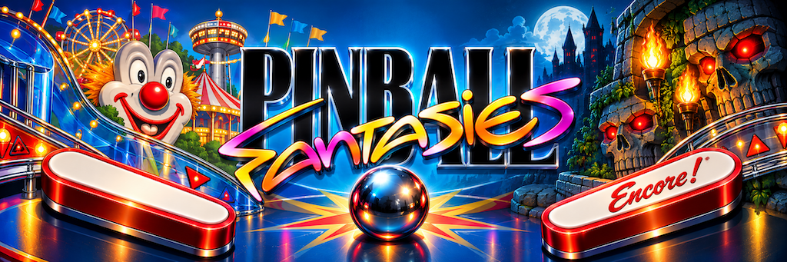

<p align="center"></p>

# Pinball Fantasies: Encore!

[](https://github.com/pedrocatalao/pinball-fantasies-encore/actions/workflows/macos.yml)
[](https://github.com/pedrocatalao/pinball-fantasies-encore/actions/workflows/linux.yml)
[](https://github.com/pedrocatalao/pinball-fantasies-encore/actions/workflows/windows.yml)

A native version of *Pinball Fantasies* (Digital Illusions / 21st Century Entertainment, 1994
PC release) for macOS, Linux and Windows, in C++20 on SDL3 and OpenGL, with remastered artwork
alongside the original look.

The engine is written from the game's own data: it reads the original DOS files and runs the
physics, the table rules and scripts, the dot matrix, the music and the menus itself. Nothing
of the original is emulated, and nothing of it is included here.

## Download

Version **0.9.0**, a first cut for testing — unpack and run, no installation:

| | |
| --- | --- |
| macOS (Apple Silicon and Intel) | [pinball-fantasies-encore-macos-universal.zip](https://github.com/pedrocatalao/pinball-fantasies-encore/releases/download/v0.9.0/pinball-fantasies-encore-macos-universal.zip) |
| Linux x86_64 | [pinball-fantasies-encore-linux-x86_64.tar.gz](https://github.com/pedrocatalao/pinball-fantasies-encore/releases/download/v0.9.0/pinball-fantasies-encore-linux-x86_64.tar.gz) |
| Linux arm64 | [pinball-fantasies-encore-linux-arm64.tar.gz](https://github.com/pedrocatalao/pinball-fantasies-encore/releases/download/v0.9.0/pinball-fantasies-encore-linux-arm64.tar.gz) |
| Windows x64 | [pinball-fantasies-encore-windows-x64.zip](https://github.com/pedrocatalao/pinball-fantasies-encore/releases/download/v0.9.0/pinball-fantasies-encore-windows-x64.zip) |

**This build has been played on macOS only.** The Linux and Windows ones are built and tested
by the machines that make them, nothing more: they compile, their tests pass, and no one has
yet sat down in front of them. If something is wrong there, that is the news I am after.

On macOS the application is not signed, so the system refuses it the first time — see
[a downloaded build on macOS](#a-downloaded-build-on-macos) below. Every release is also on
the [releases page](https://github.com/pedrocatalao/pinball-fantasies-encore/releases).

## The remaster

All four tables play exactly as the original does, and the picture on top of it can be either
the 1994 one or a remastered one (F10 switches, at any time).

**None of it is an upscale.** No filter was run over the original pictures, nothing was
enlarged and smoothed, and no machine guessed at the missing detail. Every playfield, slide,
banner, flipper and ball was made again at high resolution, drawn to the original's own
shapes, colours, lamps and lettering, so that what is on screen keeps the feel of the table
as it was rather than becoming a blurred blow-up of it. That is also why the two pictures sit
on each other exactly, pixel area for pixel area, and why F10 can swap them mid-ball:

- **Redrawn playfields** at high resolution for every table, with the lamps still working: the
  game records, per screen pixel, which original pixel it drew and how lit that spot is, and
  the renderer blends between a lit and an unlit copy of the picture there. Lamps keep their
  own shapes, labels and all.
- **Flippers drawn once and turned in code** instead of the original's frames, each about the
  axis its own artwork hinges on, so they follow the table's own angles exactly.
- **A high-resolution ball** that goes behind ramps and rails as smoothly as the artwork covers
  it, with a subtle trail that follows the physics steps rather than the frames (F8 while
  paused turns the trail off).
- **A CRT look** (scanlines, shadow mask, glow) on F9, and the original crisp pixels without it.

The redrawn pictures live in `assets/hd`; `--hd-dir` points the game at your own instead.

### The same screens, either way

Each picture is one frame drawn twice, and the line sweeps across it: the 1994 artwork on
the left of the line, the remastered one on the right. Everything else -- the geometry, the
lamps, the scrolling, the physics -- is the same on both sides. The right-hand half is not
the left one enlarged: it is its own picture, drawn to sit over the original's shapes.


## Game files

Nothing from the original is included here, apart from the redrawn pictures in `assets/hd`.
The game reads the pictures, collision maps, scripts, music and effects from a copy of the
DOS files, and it needs **exactly** the 1994 disk release, because it takes the data from
fixed addresses. At start-up every file is checked against these SHA-256 sums, and a folder
holding any other release is refused:

```
619723e39acc003c64ae5f10159ae9da6192a28642c348f455bac447a1184967  INTRO.PRG
3b897533f11163934b8e4da038143e8f7339224421803ab4108c9d10f0a7bb4a  TABLE1.PRG
37019f7bd41d896a8f5a6383a2dffc3b3e4fc63fdf1aec1cc15db99110e581eb  TABLE2.PRG
da83ef5a7a471e6a6ad759126907076c81e92ffde6dec8e3de8e6052c6a98858  TABLE3.PRG
88f63edd4c7b50bd057397016d7aa962f0ed1c858f4a746f1ccf976f67494ebf  TABLE4.PRG
aa5003c275b494062f37f44e8c77105b8a420555f4bd6ff53d7698f89c540f21  MOD2.MOD
a0877e4372abe64b70d9e361bf257ea5a84c948771f0eace3433d5f6399060b5  TABLE1.MOD
728629c54311386781271308e181ac0435f0582e90870accff0a42270d467529  TABLE2.MOD
fb7bfd1c96a462cb03999d2e6f843a20d3de69ba05fcbd384a9f1c131b9a563a  TABLE3.MOD
31ad7e671ae77c07c3d075e2f1fecd3d918fd921fa23acd9a1b0b6fc07fbbcea  TABLE4.MOD
```

> As long as you confirm you legally own a copy of the game, the correct files will be downloaded and unpacked automatically the first time you run it. 

The files are then read from one place and one only: a `FANTASY` folder inside the folder this
version keeps its own things in, which is the folder SDL gives it for the platform —
`~/Library/Application Support/Encore/Pinball Fantasies/FANTASY` on macOS,
`~/.local/share/Encore/Pinball Fantasies/FANTASY` on Linux,
`%APPDATA%\Encore\Pinball Fantasies\FANTASY` on Windows.

You can also put the files there yourself, or start the game with `--data <dir>` to read
another folder for that run.

Options and high scores are kept beside it, in the DOS formats
(`PINBALL.CFG`, `TABLEn.HI`).

## Building

The game needs CMake 3.24 or later, a C++20 compiler, SDL3 and OpenGL 4.1. Nothing else: the
pictures are decoded by this project's own PNG reader, and every OpenGL function past 1.1 is
asked of the driver through SDL, so there is no image library and no loader to install.

**macOS** (Xcode command-line tools, `brew install sdl3`; for a build that runs on both Apple
Silicon and Intel, point `-DENCORE_SDL3_FRAMEWORK=` at the official universal `SDL3.framework`
and set `-DCMAKE_OSX_ARCHITECTURES="arm64;x86_64"`):

```bash
cmake -S . -B build
cmake --build build -j
./build/encore-tests
open "build/Pinball Fantasies.app"
```

**Linux** (SDL3 from your distribution, or built from source, plus `libgl1-mesa-dev`):

```bash
cmake -S . -B build -DCMAKE_BUILD_TYPE=RelWithDebInfo
cmake --build build -j
"./build/Pinball Fantasies" --data /path/to/FANTASY
```

**Windows** (Visual Studio 2022, and the SDL3 development files unpacked somewhere):

```bat
cmake -S . -B build -A x64 -DCMAKE_PREFIX_PATH=C:\SDL3-3.4.16\cmake
cmake --build build --config RelWithDebInfo
```

On macOS the shaders and pictures go inside the application bundle; elsewhere they are copied
next to the executable, which is where the game looks for them. Settings and high scores live
in the folder SDL keeps for the platform (`~/Library/Application Support`, `~/.local/share`,
`%APPDATA%`).

## A downloaded build on macOS

The application is signed without a certificate, so macOS quarantines it like anything else
from the internet and refuses to open it — from the Finder it does nothing at all, while the
binary inside still runs from a terminal. Either right-click it and choose Open, and then Open
again, or clear the flag:

```bash
xattr -dr com.apple.quarantine "Pinball Fantasies.app"
```

Signing it properly, so that nobody has to do this, needs an Apple Developer certificate and
notarisation.

## Controls

The original layout.

| Key | Action |
| --- | --- |
| F1 to F4 | choose a table in the menu |
| F5 | options (in the menu) |
| Enter | start a game; again, before plunging, to add a player (or F1 to F8 for 1 to 8 players) |
| Left and right Shift, Ctrl or Alt | flippers |
| Down arrow | pull the plunger, release to shoot |
| Space | nudge the table (too often tilts it) |
| P | pause (see below) |
| M | music on or off |
| Escape | with the ball at the plunger, abandon the game; in attract mode, leave the table (Y to confirm); in the menu, quit |
| Command+F | fullscreen (the Windows or Super key elsewhere) |

While paused, the original's own options, and two of this version's for looking at the artwork:

| Key | Action |
| --- | --- |
| A | angle: low, high, or higher — a steeper table with stronger flippers |
| S | scrolling: hard, medium or soft |
| M, R | music on or off; resolution |
| F7 | every lamp on, then every lamp off, then as the game has them |
| F8 | the ball's trail on or off |
| Up and down arrows | scroll the table by hand |
| P | back to the game |
| Escape | abandon the game (Y to confirm) |

These two work at any time, in the menu or in play:

| Key | Action |
| --- | --- |
| F9 | CRT look on or off |
| F10 | the remastered pictures, or the originals |

## Command line

| Option | Effect |
| --- | --- |
| `--data <dir>` | folder with the game files |
| `--table <1-4>` | open a table directly |
| `--skip-intro` | go straight to the table menu |
| `--res normal\|high\|full` | screen mode: 320x240, 320x350, or the whole table at once |
| `--crt`, `--no-crt` | CRT look (scanlines, shadow mask, glow); remembered |
| `--hd`, `--no-hd` | the remastered pictures, or the originals; remembered |
| `--trail`, `--no-trail` | the fading ghosts behind the ball; remembered |
| `--hd-dir <dir>` | pictures to use instead of the application's own |
| `--smooth` | soften the one pixel that straddles two source pixels; steadies scrolling |
| `--square-pixels` | show the picture unstretched instead of filling a 4:3 screen |
| `--fullscreen`, `--scale <n>` | window options |
| `--screenshot <file>`, `--screenshot-frame <n>` | render one frame to a PNG and quit |
| `--stats` | log, once a second, how long each frame takes |
| `--verbose` | log every step, not only what matters |
| `--help` | the options, and what they do |

## Tools

| Tool | Purpose |
| --- | --- |
| `encore-play <dir> <table> [frames] [seed] [out.png]` | plays a game headlessly with a simple autopilot and prints the ball, the score, every trigger and (with `ENCORE_DM=1`) the dot matrix |
| `encore-assets <dir>` | loads every table and prints what was extracted, including each flipper's rectangle, hinge and sweep |
| `encore-extract <dir> <out>` | writes every table's artwork, collision maps, flipper frames, ball and plunger out as PNGs |
| `tools/hd_import.py <name>=<picture> ...` | prepares redrawn pictures (trims, resizes to 3x the original) into `assets/hd` |
| `tools/hd_unlit.py <lit.png> <unlit.png> <table dir>` | derives a playfield's lights-off picture from its lights-on one, using the original's lamps (needs `encore-extract` output) |

## Layout

| Path | Purpose |
| --- | --- |
| `src/assets` | Reading a table executable: artwork, collision maps, gates, triggers, lights, sounds, fonts and the table script |
| `src/table` | A table in play: physics, script interpreter, tasks, game flow, and one file per table's rules |
| `src/intro` | The slideshow and the table menu with its text, high-score and options pages |
| `src/sound` | The four-channel module player and the jingle sequencer |
| `src/game` | Application shell and the options and high-score files |
| `assets/hd` | Redrawn, high-resolution pictures drawn in place of the originals: the intro's slides, the menu's side panel, table banners and high-score heading, each table's playfield lit and unlit, the flippers and the ball |
| `assets/app` | The application icon, built into `icon.icns` at build time |
| `src/gfx`, `shaders` | Indexed framebuffer, palette, OpenGL renderer; `post.frag` is the hook for CRT-style effects and is hot-reloaded |
| `src/platform` | SDL3 window, audio device, finding the game files, fetching over HTTP |
| `src/core`, `src/data` | Types, files, PNG, deflate and zip, SHA-256, IFF pictures, the game-version check |
| `tests` | Pure-logic tests, and tests that play full games when the game files are present |
| `docs` | Notes from the reverse-engineering work |
| `re/legacy-engine` | The earlier engine this translation replaced, kept for reference; not built |

## Licence

The code is under the **GNU General Public License, version 3 or later** ([LICENSE](LICENSE)).
The redrawn artwork in `assets` is under **CC BY-SA 4.0** instead, since a software licence
fits pictures badly. [NOTICE.md](NOTICE.md) says which is which.

*Pinball Fantasies* belongs to its respective owners and this project is not affiliated with
them. No file of the original game is included here, or in anything built from it.
